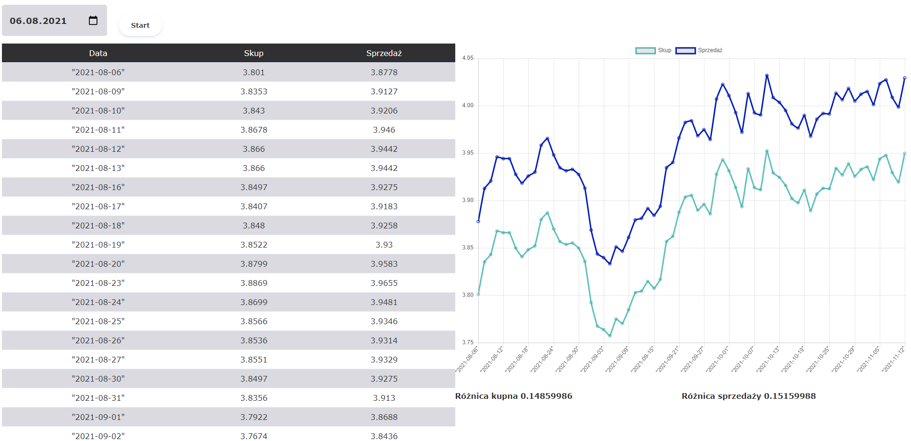

# NotowanieKursuUSD

Aplikacja internetowa, która przedstawia notowanie kursu kupna i sprzedaży USD od podanej daty do bieżącej daty wraz z różnicą wartości (kupna i sprzedaży) pomiędzy dniami. Historia kursu jest pobierana przy pomocy API Narodowego Banku Polskiego.

Technologie
-----------
- Spring boot
- Maven
- Jackson
- Chart.js 

Wygląd
-----------
Po wybraniu daty, od której będziemy szukali historię kursu i wciśnięcia przycisku "Start" na stronie zostanie wyświetlony wykres oraz tabela:

